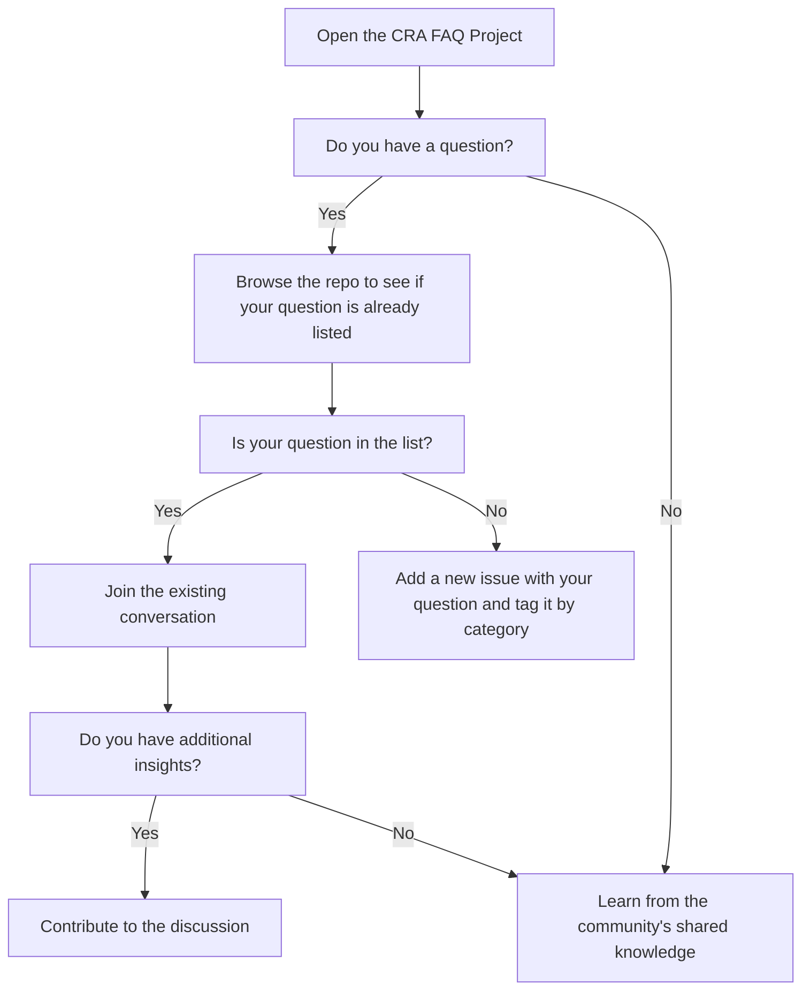

 

**Welcome to the ORC GitHub organization** – ORC is an Eclipse Foundation Working Group whose immediate focus is to help open source maintainers and users meet the compliance requirements of the **European Cyber Resilience Act (CRA).**

## The Cyber Resilience Act

The ORC WG main focus today is on supporting the open source community in developing assets that helps implement the CRA requirements. This has been translated into specific work streams as follows:
- **[CRA FAQs](https://github.com/orcwg/cra-hub)** - Either you are newbie to the CRA, or a pro already working on its implementation, the CRA FAQ is a space for the open source community to ask questions and clarify key CRA topics.
- **[ORC Deliverables Plan](https://github.com/orcwg/orcwg/blob/main/cyber-resilience-sig/deliverables.md)** - The ORC community has outlined key deliverables to work on in 2025.
- **[Inventory](https://github.com/orcwg/cra-hub/blob/main/inventory.md)** - Inventory of resources relevant to the horizontal CRA standards, Open Source Steward obligations, and the security attestation program.
- **[CRA Hub](https://github.com/orcwg/cra-hub)** - Want an overview of our CRA-related work? This is the place to do it.

## How to contribute 
### Step 1 - Stay up to date by joining our meetings and communication channels
- **Join our calls**. Our [meetings](https://github.com/orcwg/orcwg/blob/main/MEETINGS.md) are public and open to all. ([iCal format](https://calendar.google.com/calendar/ical/c_7db8e3f13c4fac984103918a97c704bb1d619da0fdb66d33f1747849b6020aea%40group.calendar.google.com/public/basic.ics))
- **Subscribe to our [mailing List](https://accounts.eclipse.org/mailing-list/open-regulatory-compliance)** ([Archive](https://www.eclipse.org/lists/open-regulatory-compliance/maillist.html))
- **Join our [Slack](https://orcwg.slack.com/) channel** ([Request invitation](https://join.slack.com/t/orcwg/shared_invite/zt-2vi7gi5ad-re2b35i95ar3WaVF2zoZaA))

### Step 2 - Participate in our ongoing activities.
- **White paper on Open Source project types** - Find the details [here](https://github.com/orcwg/cra-hub/tree/project-types/white-papers/project-types) and the Contributing Guidelines [here](link to be added)
- **Vulnerability Management Task Force** - Check its objectives [here](). If you are ready to join and contribute check [here]() how to do it.

### Step 3 - Prepare for what is coming
- Check the [**Deliverable Plan**](https://github.com/orcwg/orcwg/blob/main/cyber-resilience-sig/deliverables.md#deliverables-plan) and get ready to contribute to them.

## The CRA FAQ 
The CRA FAQ is a community effort for clarifying parts of the CRA text and related obligations in regards to how the Open Source Community is impacted.
### Contribute to the FAQ
Contributing the FAQ is fairly easy, just follow this flow

### I'm a developer/maintainer in an open source project
- Here you have a few pointers that can help you in your work towards compliance:
	- [CRA FAQs for maintainers](https://github.com/orcwg/cra-hub/blob/main/faq.md#maintainers)
 	- [CRA FAQs open conversations for maintainers](https://github.com/orgs/orcwg/projects/7/views/2)

### I work for an OSPO
- Specific actions for 
	- [CRA FAQs for manufacturers](https://github.com/orcwg/cra-hub/blob/main/faq.md#manufacturers)
 	- [CRA FAQs open conversations for manufacturers](https://github.com/orgs/orcwg/projects/7/views/4) 	

### I work for a Steward
- [CRA FAQs for Stewards](https://github.com/orcwg/cra-hub/blob/main/faq.md#open-source-software-stewards)
- [CRA FAQs open conversations for stewards](https://github.com/orgs/orcwg/projects/7/views/3)

